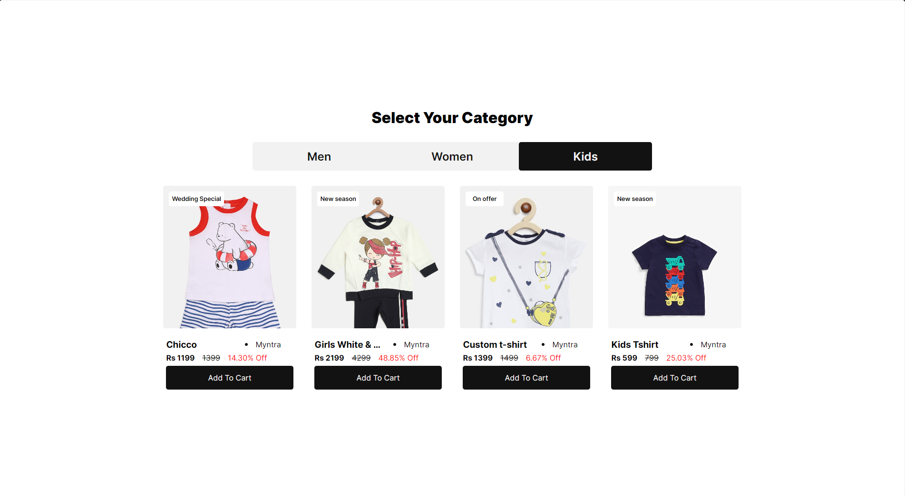

Here's a comprehensive README file for your e-commerce app project:

---

# E-Commerce Category Selector

This project is a simple e-commerce app that allows users to select a product category and view the products within that category. The app fetches product data from an API and dynamically updates the UI to display the products based on the selected category.



## Table of Contents

- [Features](#features)
- [Technologies Used](#technologies-used)
- [Getting Started](#getting-started)
- [Usage](#usage)
- [Code Overview](#code-overview)
  - [HTML](#html)
  - [CSS](#css)
  - [JavaScript](#javascript)

## Features

- Dynamic category selection
- Fetches product data from a remote API
- Displays products based on selected category
- Includes product details like image, title, vendor, price, and discount

## Technologies Used

- HTML
- CSS
- JavaScript

## Getting Started

To get a local copy up and running follow these simple steps:

### Prerequisites

- A modern web browser
- Internet connection to fetch data from the API

### Error

I got this error while opening the index.html in chrome:

```
index.html:1 Access to script at 'file:///C:/Users/snowi/code/learn/web/frontend/category-tabs/script.js' from origin 'null' has been blocked by CORS policy: Cross origin requests are only supported for protocol schemes: http, data, isolated-app, chrome-extension, chrome, https, chrome-untrusted.
```

Chrome does not allow to open `file://` due to security reason. So,

To start, install

```bash
 npm install --global serve
```

and

Run this command in the terminal

```bash
serve
```

## Usage

1. Open the index.html in your browser.
2. Select a category from the tabs (Men, Women, Kids).
3. The products for the selected category will be displayed.

## Code Overview

### HTML

The HTML file contains the basic structure of the app, including the container for the category tabs and product cards.

### CSS

The CSS file provides styles for the app, including layout, typography, and visual effects.

### JavaScript

The JavaScript file contains the logic for fetching product data from the API, handling category selection, and rendering products on the UI.
